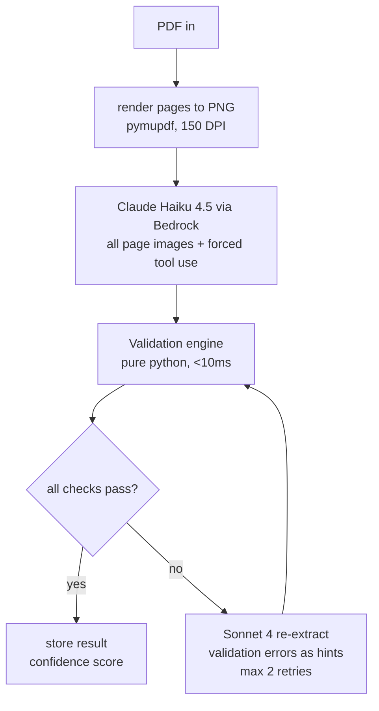
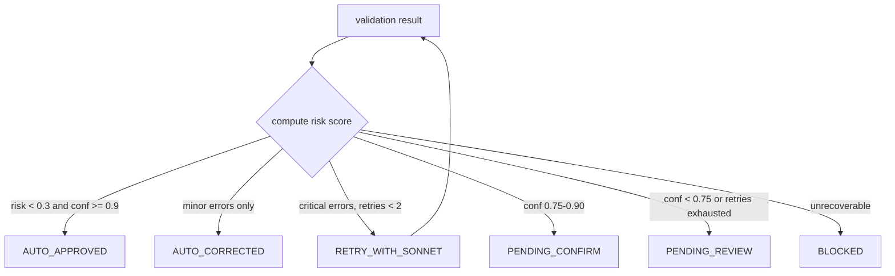

# agentic-doc-intel

vision-language document extraction that skips OCR. render a pdf to page images, send them straight to a VLM with forced tool use, validate the output with deterministic rules, then route by confidence. built for b2b order documents (purchase orders and order acknowledgments) and designed to extend to any document type.

this came out of an internal rebuild of a broken OCR pipeline. the numbers below are from that work, anonymized. i pulled the core into a reusable library.

```
pdf -> page images (150 dpi) -> haiku 4.5 (forced tool use) -> validation -> decision -> result
```

## tldr

- replaced a 3-service stack (OCR -> regex parser -> schema mapper) with a 2-step VLM path (image -> one bedrock call).
- went from **40% header accuracy and a 73% pipeline failure rate** to **93.7% headers / 90.6% line items** on the labeled benchmark, **0 failures**, and **100% field accuracy on the 5 live production documents**.
- cost dropped from ~$0.03-0.05/doc to **~$0.008/doc**. processing from ~52s (OCR alone) to **8-16s** end to end.
- ~**93%** of documents clear with no human in the loop.

## the problem

the old pipeline had three steps. an OCR model read the pdf into markdown, a regex parser with hardcoded field patterns mapped that markdown to our schema, then we stored it. OCR was fine. the regex parser is where everything fell apart. every vendor lays documents out differently, so you fix one pattern and break another. it got 40% header accuracy on the 4 of 15 documents that made it through, and timed out on the rest. 73% failure rate on the larger files.

## what i tried (chronological)

**1. fix the regex parser.** more patterns for customer_number, terms, the six date formats we kept seeing. moved headers from 33% to 40%. dead end. every new layout needs new patterns, and the person who wrote the original parser said the same thing: it was hardcoded for specific formats and would never generalize.

**2. LLM mapper.** feed the OCR markdown plus the schema to a small model instead of regex. 98% headers, 80% line items. real jump. but it still sits on top of the OCR step, which still fails ~73% of the time on larger and scanned docs. you have not removed the broken part, you have just put a smarter thing behind it.

**3. VLM direct.** skip OCR completely. render the pdf pages to png and send the images to the model with forced tool use. no markdown, no regex, one bedrock call. the model reads pixels, so it sees tables, letterheads, logos and layout directly. zero failures across all 15 docs, then it held up on 43 unseen documents and on 5 live production docs.

## how it works



1. **render.** pdf to png at 150 dpi with pymupdf. a 3-page document is ~3 images in under a second. 150 dpi is the sweet spot. 300 dpi costs about 4x the image tokens for no accuracy gain.
2. **extract.** one bedrock `converse` call to claude haiku 4.5 with every page image and a tool definition. `toolChoice` is forced to the extract tool, so the model has to return json matching the schema. temperature 0. no free text to parse.
3. **validate.** a pure python rules engine, no model call, runs in under 10ms. it catches math errors, impossible dates, missing fields and the field confusions the model occasionally makes.
4. **route.** a risk score maps the result to one of six outcomes, from auto-approve to human review.
5. **recover.** if validation fails, re-extract with claude sonnet 4 and pass the validation errors back as hints. max 2 retries, then it goes to a human queue.

### the tool definition is the trick

the model is forced to call one tool, `extract_document`, against a strict json schema: `additionalProperties: false`, every field required, each value present or null. because it is tool use, the output is always valid json in the exact shape you asked for. no regex, no "parse the markdown," no format guessing.

```python
TOOL = {
    "name": "extract_document",
    "description": "Extract structured fields from the document images.",
    "input_schema": {
        "type": "object",
        "additionalProperties": False,
        "required": ["po_number", "vendor_name", "total_amount", "line_items", "field_confidences"],
        "properties": {
            "po_number":       {"type": ["string", "null"]},
            "vendor_name":     {"type": ["string", "null"]},
            "ack_date":        {"type": ["string", "null"]},
            "customer_number": {"type": ["string", "null"]},
            "terms":           {"type": ["string", "null"]},
            "total_amount":    {"type": ["number", "null"]},
            "line_items": {
                "type": "array",
                "items": {
                    "type": "object",
                    "additionalProperties": False,
                    "required": ["item_number", "quantity", "unit_price", "amount"],
                    "properties": {
                        "item_number": {"type": ["string", "null"]},
                        "quantity":    {"type": ["number", "null"]},
                        "unit_price":  {"type": ["number", "null"]},
                        "amount":      {"type": ["number", "null"]},
                    },
                },
            },
            "field_confidences": {"type": "object"},
        },
    },
}
# bedrock converse: toolChoice = {"tool": {"name": "extract_document"}}
```

## validation engine

five rule groups, all deterministic:

- **financial.** `qty * unit_price = amount` (tolerance $0.01). sum of line items = total (tolerance $0.02). no negative money. this catches the most dangerous error there is, a wrong total.
- **dates.** real calendar dates only (no feb 30), range 2020-2030, `order_date <= ship_date <= arrival_date`.
- **required fields.** per document type. every line item needs item_number, quantity and amount.
- **cross-field.** po_number can't equal acknowledgment_number. vendor can't equal ship-to or bill-to (the vendor is not the customer).
- **auto-correction.** normalize any date format to YYYY-MM-DD, convert "N/A" / "-" in numeric fields to null, trim whitespace, fix 1-cent rounding.

the engine returns a small report that travels with the document:

```json
{
  "valid": false,
  "error_count": 2,
  "warning_count": 1,
  "correction_count": 3,
  "confidence_score": 0.85
}
```

## decision routing



six outcomes: `AUTO_APPROVED`, `AUTO_CORRECTED`, `RETRY_WITH_SONNET`, `PENDING_CONFIRM`, `PENDING_REVIEW`, `BLOCKED`. the first three need no human. on the production set, 93% landed in those three.

## results

the journey, each row is the same 15-doc labeled set unless noted:

| stage | docs processed | headers | line items | note |
|---|---|---|---|---|
| regex parser | 4 / 15 (73% failed) | 40% | 90%* | dead end |
| LLM mapper | 9 / 15 | 98% | 80% | smarter, still needs OCR |
| VLM direct (phase 1) | 15 / 15 | 90.6% | 73.6% | zero failures, no OCR |
| + validation engine | 15 / 15 | 93.7% | 90.6% | catches hallucinations |
| unseen benchmark | 43 | 97.7% | - | 25+ vendor formats, first contact |
| **production (live)** | **5** | **100%** | **100% (41/41)** | deployed and verified |

\* regex line items were only measurable on the 4 docs that completed.

production run, 5 live documents on the deployed endpoint, every field checked against the pdf by hand (vendor names anonymized):

| document | pages | line items | total | decision | time |
|---|---|---|---|---|---|
| acknowledgment, vendor A | 1 | 2 / 2 | $17,965.80 | AUTO_APPROVED | 25.2s |
| acknowledgment, vendor B | 3 | 5 / 5 | $24,893.18 | AUTO_APPROVED | 12.5s |
| purchase order, vendor C | 1 | 23 / 23 | $8,692.27 | AUTO_APPROVED | 21.5s |
| acknowledgment, vendor D | 1 | 5 / 5 | $63,894.98 | AUTO_APPROVED | 10.5s |
| acknowledgment, vendor E | 2 | 6 / 6 | $95,385.50 | AUTO_APPROVED | 11.8s |

5/5 on vendor, po number and total. 41/41 line items, including a single dense page with 23 of them. all auto-approved. average 16s/doc, ~$0.01/doc on the live endpoint.

## cost

haiku 4.5 on bedrock is $0.80 per million input tokens and $4.00 per million output. a document is ~3k input tokens (images plus prompt) and ~1.5k output, so about **$0.008/doc**.

| volume | this library | traditional OCR stack |
|---|---|---|
| 1,000 docs/month | $8 | $50 - $150 |
| 10,000 docs/month | $80 | $500 - $1,500 |
| 100,000 docs/month | $800 | $5,000 - $15,000 |

sonnet retries add ~$0.02 each. at a 20% retry rate the blended cost is ~$0.012/doc.

## quickstart

```bash
pip install -r requirements.txt
# needs AWS creds with bedrock access in your environment
```

```python
from agentic_doc_intel import DocumentIntelligence

engine = DocumentIntelligence(
    model="us.anthropic.claude-haiku-4-5-20251001-v1:0",
    retry_model="us.anthropic.claude-sonnet-4-20250514-v1:0",
)

result = engine.process("acknowledgment.pdf", doc_type="acknowledgment")

print(result.decision)        # AUTO_APPROVED
print(result.confidence)      # 0.95
print(result.data["vendor_name"])
print(result.data["total_amount"])
```

see [examples/quickstart.py](examples/quickstart.py) for the full flow and [examples/sample_output.json](examples/sample_output.json) for the shape of a result.

## extending to a new document type

three things, no framework changes:

1. a **schema** - the json the model has to return.
2. a **system prompt** - what to look for and where.
3. **validation rules** - required fields and the financial/date relationships.

purchase order and acknowledgment adapters ship today. invoice and quote are on the roadmap.

## things that bit me

notes for anyone building this:

- haiku 4.5 needs the cross-region inference profile id (`us.anthropic.claude-haiku-4-5-...`). the plain model id does not work on-demand.
- 150 dpi is enough. do not pay for 300.
- send all pages in one call. the 200k context handles 10+ page documents without splitting or merging.
- forced tool use is the whole game. without it you are back to parsing text and guessing formats.

## roadmap

- python package release
- invoice and quote adapters
- multi-model backends (swap the haiku/sonnet pair for other providers)
- batch processing api
- self-hosted option

## license

MIT. see [LICENSE](LICENSE).

---

built by Ateeb Taseer. [linkedin.com/in/ateebtaseer](https://www.linkedin.com/in/ateebtaseer) · [github.com/Cardano-max](https://github.com/Cardano-max)

demo walkthrough: _Loom link goes here_
