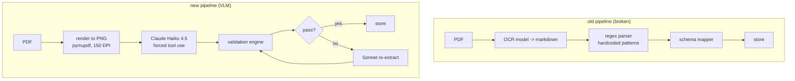

# architecture

## before and after

the old pipeline was three services chained together. the new one is two steps.

what got removed: the OCR service (its own container and task), the regex parser,
and the OCR-invocation HTTP hops between them. what got added: one extraction
service (~300 lines), per-document-type schemas (static dicts), and per-type
system prompts.

## the five layers

| # | layer | what it does | how |
|---|---|---|---|
| 1 | extraction | schema-constrained image-to-JSON | Haiku 4.5, forced tool use |
| 2 | validation | financial math, dates, required fields, cross-field | pure python, <10ms |
| 3 | suspicion scoring | weight uncertain fields into a risk score | deterministic |
| 4 | decision | route to one of six outcomes | deterministic |
| 5 | recovery | targeted retry with error context | Sonnet 4, max 2 retries |

no single point of failure. each layer catches what the one before it missed.
extraction is the only model call on the happy path; everything after it is
plain python until a retry is actually needed.

## why forced tool use

a normal completion gives you free text you then have to parse, which is exactly
the regex problem again. forcing the model to call one tool against a strict json
schema (`additionalProperties: false`, all fields required, value-or-null) means
the output is always valid json in the shape you asked for. classification,
extraction and schema-conformance happen in the one call.

## adding a document type

three things, no framework changes:

1. a schema (the json the model returns) in `schemas.py`
2. a system prompt for that type
3. the required-field and financial rules in `validation.py`

purchase order and acknowledgment ship today. invoice and quote are next.
